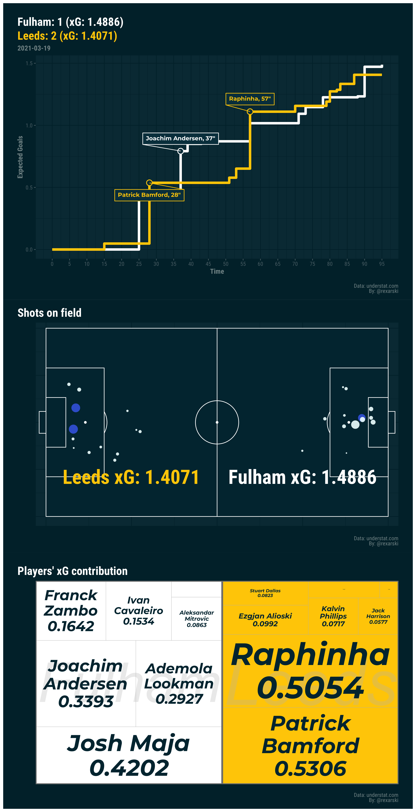

# box2box: a repository of sports analytics experiments

You can find some of the data sources [here](http://rqiu.georgetown.domains/02-gather.html).

### Expected goals timeline, field shots and player contributions

### Pass flow graphs

### Top goalscorers in Jiangsu FC's history

